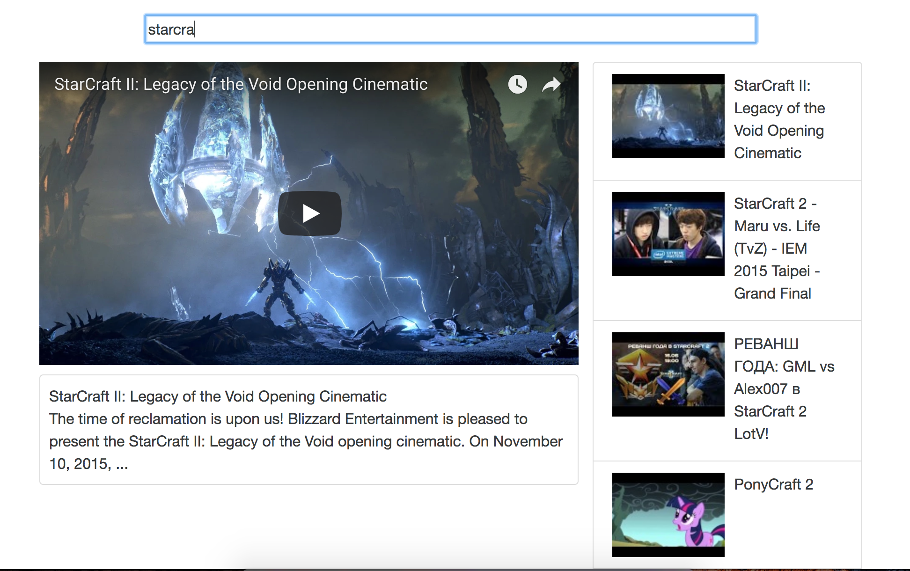
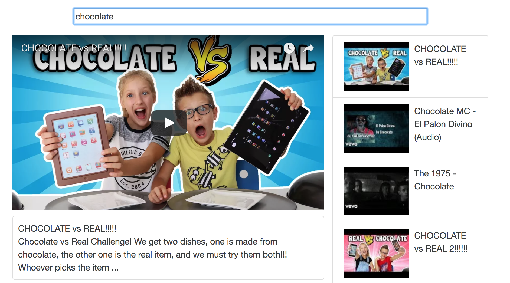

Checkout this repo, install dependencies, then start the gulp process with the following:

```
> npm install
> npm start
```

Or run it on Docker:
```
docker build -t react-youtube-docker .
#### Map your local host port 4001 to the docker app server's port 8080
docker run -it -p 4001:8080 react-youtube-docker
```

# YoutubeSearch
Search and plays Youtube videos 
- Ajax Requests with React.js
- includes functional/class components of video detail, video list. 



